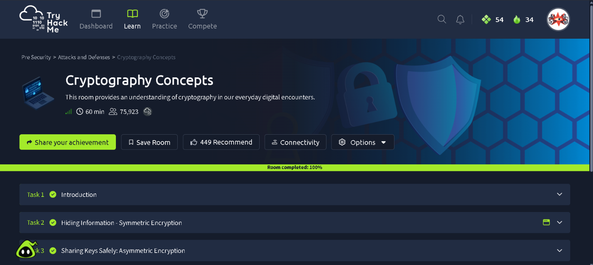
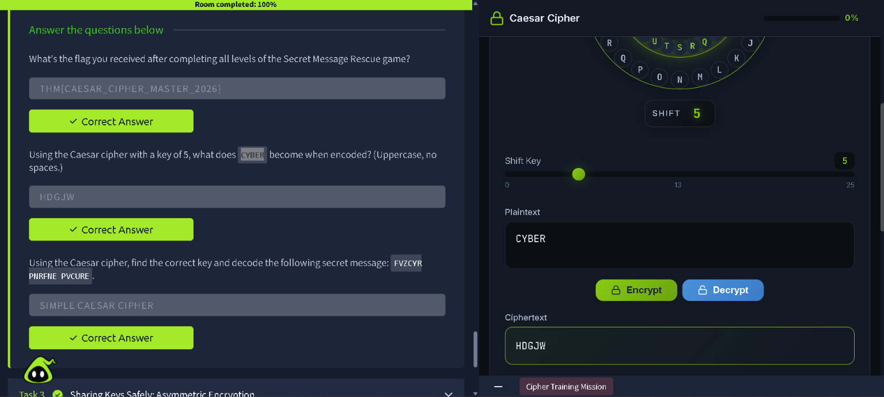
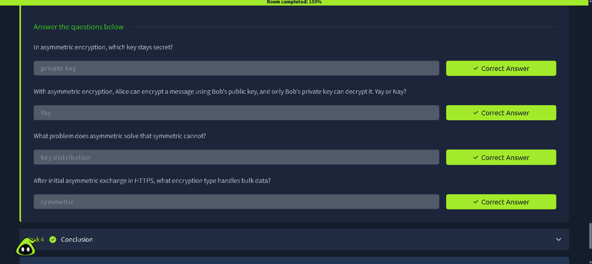

# TryHackMe: Cryptography Concepts — Writeup

**Room:** [Cryptography Concepts](https://tryhackme.com/room/cryptographyconcepts) · Pre Security → Attacks and Defenses
**Difficulty:** Info / Beginner
**Status:** ✅ Room completed — 100%

## Overview

This room builds an understanding of cryptography as it applies to everyday digital encounters — covering symmetric encryption (shared-key), asymmetric encryption (public/private key pairs), and where each is actually used in something like HTTPS.

**Tasks:**
1. Introduction
2. Hiding Information — Symmetric Encryption
3. Sharing Keys Safely — Asymmetric Encryption
4. Conclusion

---

## Task 2 — Hiding Information: Symmetric Encryption

Symmetric encryption uses a single shared key for both encrypting and decrypting data — the same key locks and unlocks the message, so both parties need to already possess it.

This task used a **Caesar cipher** as a hands-on introduction to symmetric encryption — where each letter is shifted a fixed number of places in the alphabet, and that shift value ("key") is what both sender and receiver need to know.

### Encrypting with a key

Using the built-in Caesar cipher tool, encrypting `CYBER` with a shift key of `5` produced `HDGJW`.

**Answers:**
| Question | Answer |
|---|---|
| Using the Caesar cipher with a key of 5, what does `CYBER` become when encoded? | `HDGJW` |
| Decode `FVZCYR PNRFNE PVCURE` (find the correct key) | `SIMPLE CAESAR CIPHER` |

### Secret Message Rescue game

Completing all levels of the room's Caesar-cipher practice game returned a completion flag.

**Flag:** `THM{CAESAR_CIPHER_MASTER_2026}`

---

## Task 3 — Sharing Keys Safely: Asymmetric Encryption

Asymmetric encryption solves the key-distribution problem that symmetric encryption can't: instead of one shared secret, each party has a **key pair** — a public key (shareable with anyone) and a private key (kept secret). Data encrypted with someone's public key can only be decrypted with their matching private key.

**Answers:**
| Question | Answer |
|---|---|
| In asymmetric encryption, which key stays secret? | `private key` |
| Alice encrypts with Bob's public key — only Bob's private key can decrypt it. Yay or Nay? | `Yay` |
| What problem does asymmetric solve that symmetric cannot? | `key distribution` |
| After the initial asymmetric exchange in HTTPS, what encryption type handles bulk data? | `symmetric` |

This last point is the key real-world insight: **HTTPS uses both** — asymmetric encryption to safely exchange a session key during the initial handshake, then fast symmetric encryption for the actual bulk data transfer afterward.

---

## Summary

This room walked through the two foundational pillars of modern cryptography: symmetric encryption (fast, but requires a pre-shared key) and asymmetric encryption (solves key distribution using public/private key pairs), and tied them together by explaining how HTTPS combines both in practice.

**Room completion: 100%** ✅

**Key takeaways:**
- Symmetric encryption is fast and simple but has a bootstrapping problem: how do you safely share the key in the first place?
- Asymmetric encryption solves key distribution at the cost of speed — which is why it's used only for the handshake, not for bulk data.
- HTTPS is a practical hybrid: asymmetric crypto establishes trust and exchanges a session key, then symmetric crypto handles the actual traffic efficiently.
